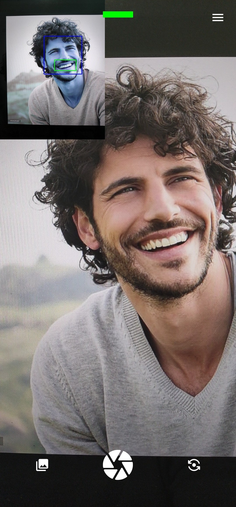

# SmileCollection

A multi-module Android project that integrates OpenCV for face/smile detection. This repository contains an `app` Android application module and an `OpenCV` module (native/CMake and cascade resources).

## Project structure

- `app/`: Android application module (`AndroidManifest.xml`, `src/main/java/`, `res/`).
- `OpenCV/`: OpenCV integration, native code, CMake, and `etc/haarcascades/` resources (e.g. `haarcascade_smile.xml`).
- Root Gradle files: `settings.gradle`, `build.gradle`, Gradle wrapper (`gradlew`, `gradlew.bat`).
- IDE metadata: `.idea/` and Gradle cache `.gradle/` (these are typically not committed).

## Prerequisites

- Android Studio (recommended) or command-line Gradle with the Android SDK.
- Java JDK (JDK 11+ recommended depending on plugin).
- Android SDK Platform, Platform Tools, Build Tools via SDK Manager.
- If building native code: Android NDK and CMake (install via SDK Manager).

If you use the command line, ensure `local.properties` points to your Android SDK, e.g.:

```
sdk.dir=C:\Users\Acer\AppData\Local\Android\Sdk
```

## Build & Run (Android Studio)

1. Clone repository
2. Install Android Studio with SDK + NDK + CMake
3. Open project in Android Studio
4. Let Gradle sync and install missing components
5. Connect device and Run `app` module

### Native / OpenCV notes

- Confirm `app/build.gradle` correctly references the `OpenCV` module or includes the native libraries (`jniLibs`) and `externalNativeBuild` (CMake) configuration.
- Ensure the NDK version used matches project configuration (set via `ndkVersion` in Gradle or choose via SDK Manager).

### Troubleshooting

- "SDK not found" or missing build tools: create/update `local.properties` or install SDK components in Android Studio.
- CMake/NDK errors: install the required versions via the SDK Manager and confirm `ndkVersion` in `app/build.gradle`.
- App fails to build due to missing sources: verify `app/src/main/java/` contains your app code and package names match `AndroidManifest.xml`.

## App screenshot

